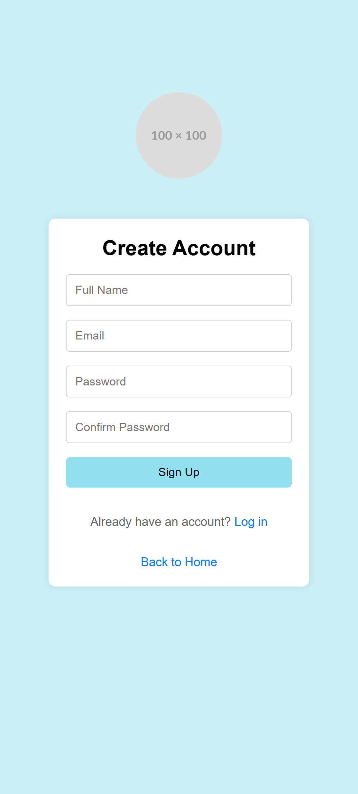

# Expense Tracker App 💰

A React Native mobile app powered by Supabase that helps users monitor spending with secure magic-link authentication. Developed as a school project to master real-world mobile development, this app includes:
- 🔐 **Passwordless Login**: Secure magic-links via Supabase Auth  
- 💸 **Transaction Tracking**: Log and view last 10 expenses  
- 📈 **Data Visualization**: Monthly/yearly spending charts  
- ⚙️ **Profile Management**: Update names or delete accounts  

## 🛠 Tech Stacks

   

### Key Libraries
- **Auth**: Supabase Magic Links
- **Database**: Supabase PostgreSQL
- **Charts**: React Native Chart Kit
- **State Management**: React Context

## DevOps with GitHub Actions

The project uses a GitHub Actions workflow to automatically check and fix code formatting using Biome when a pull request is made.

### Format Workflow
The Format Workflow runs automatically when a pull request is created for the main branch, and it changes `.tsx` and `.ts` files. It makes sure the code stays clean and properly formatted.

Steps it does:
- Checks out the pull request code.
- Sets up Node.js version 20.
- Installs project dependencies (using npm ci).
- Runs the format script (using npm run format).
- If any formatting changes happen, it automatically commits and pushes the changes back to the pull request.

[Format Workflow](./.github/workflows/format.yml)

## 📸 Screenshots

Click to see Landing Page

### Before

### After

Click to see Dashboard Page

### Before

### After

Click to see Visualization Page

### Before

### After

Click to see Settings Page

### Before

### After

## 🎥 Demo

Check out the video demo on YouTube:  
👉 [https://www.youtube.com/shorts/IUMmoQ-PHQc](https://www.youtube.com/shorts/IUMmoQ-PHQc)

